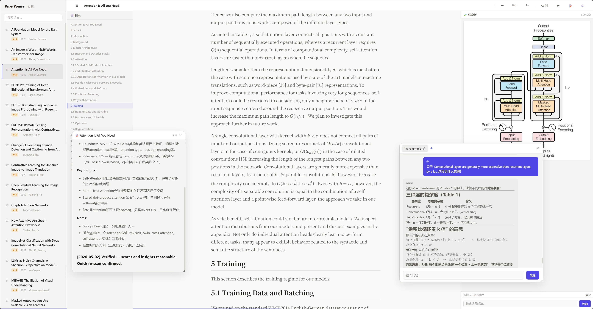

# Paperweave 


**🤖👤 For Both**

> **Paperweave is an AI Agent-oriented academic literature knowledge base system — turn papers into a queryable, evolvable, collaborative knowledge graph.**

---

## What Paperweave Does

**👤 For Human**

- **Structured Knowledge Graph** — 5-layer knowledge model, from raw papers to publication strategy
- **Full-Text Deep Reader** — Web Reader with LLM translation / chat / highlighting / starring
- **AI Agent Native** — one command to let your Agent auto-read papers, write reviews, and update the knowledge base
- **Citation Mining** — automatically discover key citations during reading, building research lineages

---

## A Concrete Example

**👤 For Human**

You drop in an arXiv paper, and it:

1. **Extract** — MinerU converts the PDF to `full.md`, with full text + figures + formulas
2. **Review** — Your AI Agent writes a structured review: scoring, core insights, code audit
3. **Classify** — Automatically determines domain → task → approach, filing it into the appropriate Lineage
4. **Deep Read** — You read section by section in a Reader with LLM translation / chat / highlighting / starring
5. **Citation Mining** — Automatically discovers 3-8 key citations during reading, added to the to-read queue

```
arxiv.org/abs/2304.08485
       │
       ▼
   MinerU extraction
       │
       ▼
 paperweave/L0_raw/visual-instruction-tuning/
   ├── full.md          ← Full text + all figures and formulas
   ├── review.md        ← Structured review by Agent
   ├── images/          ← Extracted images
   └── code/            ← Cloned open-source code
       │
       ▼
   Auto-classify → L2_lineage/multimodal/vlm/late-fusion.md
       │
       ▼
   Deep read in Reader: highlight key passages → Chat with specific questions → translate dense sentences
```



*The Papereader web interface — three-panel layout: left sidebar for paper navigation and knowledge graph browsing, center for full-text reading with annotation highlighting, right for AI chat and instant translation. Supports bilingual reading, Agent-assisted Q&A, and markdown export.*

---

## Agent-First Installation

**🤖 For Agent**

```bash
git clone https://github.com/nousresearch/paperweave-v1.git && cd paperweave-v1 && python3 -m venv .venv && source .venv/bin/activate && pip install -r papereader/requirements.txt && cp papereader/.env.example .env
```

Edit `.env` to fill in API keys, then:

```bash
cd papereader && bash start.sh          # Start the Reader server
python skills/paper-agent/agent.py ingest --arxiv <id>  # Ingest a paper
python skills/paper-agent/agent.py review <slug>       # Auto-read + review
```

> For detailed build instructions, see [docs/BUILD.md](./docs/BUILD.md)

---

## Architecture Overview: Five-Layer Knowledge Model

**👤 For Human**

```
                         ┌──────────────────────────┐
                         │   L4 — Editorial            │
                         │   Where to submit? How to   │
                         │   position?                  │
                         ├──────────────────────────┤
                         │   L3 — Module (Problems)     │
                         │   What problems exist?       │
                         │   What has been tried?       │
                         ├──────────────────────────┤
                         │   L2 — Lineage (Evolution)   │
                         │   How did approaches evolve? │
                         ├──────────────────────────┤
                         │   L1 — Ecology               │
                         │   Who collaborates with      │
                         │   whom?                       │
                         ├──────────────────────────┤
                         │   L0 — Raw                   │
                         │   Immutable paper full text  │
                         └──────────────────────────┘
```

| Layer | Name | Question Answered | Location |
|------|------|-----------|------|
| **L0** | Raw Source Material | What papers do I have? | `paperweave/L0_raw/<slug>/` |
| **L1** | Ecology | Who collaborates with whom? | `paperweave/L1_ecology/` |
| **L2** | Lineage | How did approaches evolve? | `paperweave/L2_lineage/<domain>/<task>/<approach>.md` |
| **L3** | Module | What problems exist? What has been tried? | `paperweave/L3_module/<problem>.md` |
| **L4** | Editorial | Where to submit? How to position? | `paperweave/L4_editorial/` |

**L0 is the immutable raw paper full text (build your own via ingestion). L1-L4 are continuously evolving synthesized knowledge — 144 papers, 61 lineage pages, 8 problem modules, 4 venue profiles, ready to read.**

---

## Quick Start

**👤 For Human**

```bash
# Start the Web Reader
cd papereader && bash start.sh
# Browser opens http://localhost:8899
```

**Prerequisites:**
- Python 3.10+
- MinerU API key (for PDF extraction): set `MINERU_TOKEN` in `.env`
- (Optional) Zotero SQLite for deduplication

---

## Documentation Index

**🤖👤 For Both**

| Document | Contents |
|------|------|
| [docs/SPEC.md](./docs/SPEC.md) | Paperweave Protocol v1.0 — five-layer knowledge model, file formats, API contracts, ingestion pipeline, Agent interaction standards |
| [docs/AGENTS.md](./docs/AGENTS.md) | AI Agent Operations Manual — how to clone, configure, launch, ingest papers, auto-review, common troubleshooting |
| [docs/GUIDE.md](./docs/GUIDE.md) | Complete User Guide — reading workflow, paper ingestion, L2/L3 page construction, cron automation |
| [docs/BUILD.md](./docs/BUILD.md) | Complete Build Guide — set up from scratch, configure, run, test |

---

## Directory Structure

**🤖👤 For Both**

```
paperweave-v1/
├── docs/                     📚 All documentation (SPEC, AGENTS, GUIDE, BUILD)
├── paperweave/               📖 Knowledge base: 144 papers, 141 reviews,
│   ├── L0_reviews/               61 L2 lineage pages, 8 L3 modules, 4 L4 profiles
│   ├── L1_ecology/
│   ├── L2_lineage/
│   ├── L3_module/
│   └── L4_editorial/
├── papereader/               🌐 Web Reader reference implementation
│   ├── server.py
│   ├── export.py
│   ├── start.sh
│   └── static/
└── skills/                   🤖 5 packaged skills (pdf-extract, zotero-bridge,
    ├── pdf-extract/              auto-ingest, paper-agent, curation)
    ├── zotero-bridge/
    ├── auto-ingest/
    ├── paper-agent/
    └── curation/
```

---

## Open Source License

MIT License — see [LICENSE](./LICENSE)

---

*Paperweave v1 — "Read anew, understand anew": every rereading is a new understanding.*
